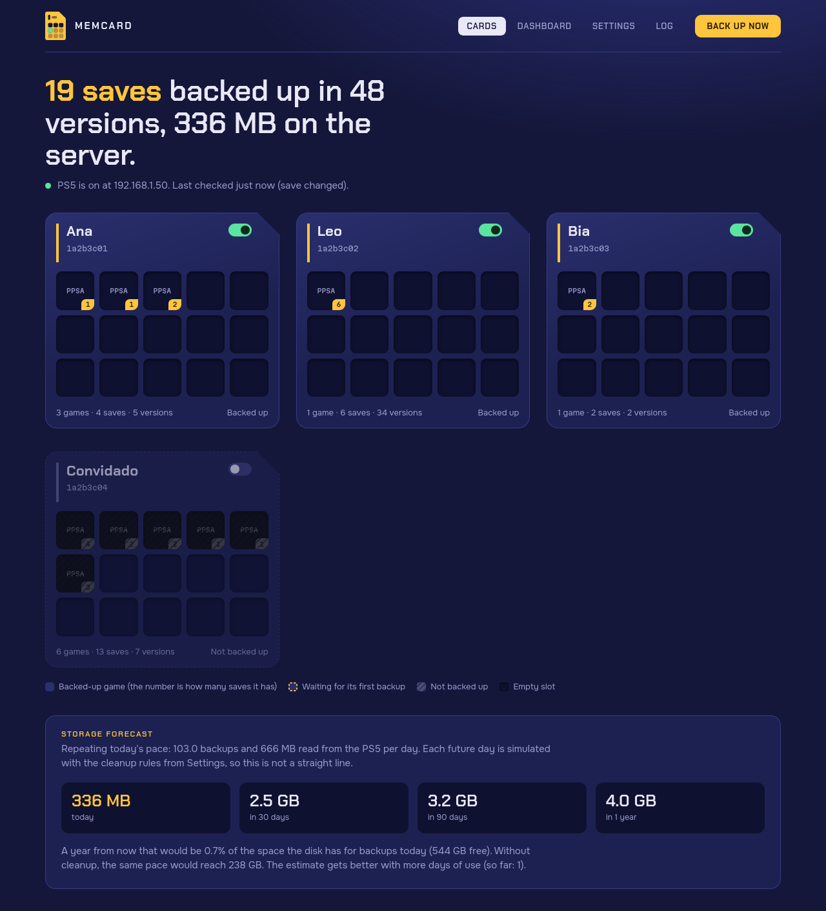

<p align="center"></p>

# Memcard

**English** · [Português](README.md)

A memory card for your PS5: automatic, versioned backups of the saves on a
jailbroken console, stored on a computer in your home network, with a web
interface.



*Sample data. In real use each block shows the game's icon.*

- **Read-only on the PS5.** It only lists and downloads files over the console's FTP server. Nothing is written, deleted or restored on it.
- **Every profile**, each one switched on or off with a single tap.
- **Version history** for every save, with checksums, so you can go back in time.
- **Cleanup that doesn't erase the past:** old versions are thinned out, not wiped, and go through a trash folder first.
- **Discord notifications without the flood:** one message per play session, edited in place.
- **No dependencies:** a single Python container using only the standard library.
- **Interface and notifications in English or Brazilian Portuguese.**

> This project exists to keep **your own saves** safe. It does not copy games
> and does not help you jailbreak the console.

## What you need

1. A PS5 that is already jailbroken, running the **ftpsrv** payload
   ([ps5-payload-dev/ftpsrv](https://github.com/ps5-payload-dev/ftpsrv)) on
   port 2121. Most payload bundles load it for you.
2. An always-on computer in the same network (server, laptop, mini PC, NAS)
   with **Docker** and **Docker Compose**.
3. A fixed IP for the PS5 on your router (DHCP reservation), so it doesn't change.

To restore a save you will also want
[Garlic SaveMgr](https://git.etawen.dev/earthonion/garlic-savemgr) on the PS5.

## Installation

```sh
git clone https://github.com/bps2414/memcard.git
cd memcard
cp config.example.toml config.toml
cp .env.example .env
```

Open `config.toml` and replace `host` with your PS5's IP. Then:

```sh
docker compose up -d --build
```

Open `http://<computer-ip>:8765`. With the PS5 on and ftpsrv loaded, the first
backup happens on its own in under a minute.

Backups live in the `data/` folder next to the project. To keep them on another
disk, change `BACKUP_DIR` in `.env`.

## Language

The interface follows your browser's language (Portuguese or English) and can
be changed under **Settings › Language**; that choice is stored in the browser.
Discord notifications use the `language` key in `[notify]` (`"pt-BR"` or
`"en"`), also editable in Settings. The service log and the command line stay
in Portuguese.

## Using the interface

**Cards.** Each PS5 profile is a memory card and each game is a block. The
number on a block is how many saves that game has (a game usually writes several
files: profile, system, each slot). The switch on the card adds or removes the
profile from the backup. Click a block to see the game's saves, each one's
history, download or pin a version, or leave the game out of the backup.

**Settings.** Everything is configurable there and takes effect immediately, no
restart needed: triggers, cleanup rules, notifications and the console address.
The interface rewrites `config.toml`; editing the file by hand works too.

**Storage forecast.** Below the cards, the page estimates how much space the
backups will take in 30 days, 90 days and 1 year. It replays the real backup
pace of the last few days and simulates each future day with your cleanup rules.

**Dashboard.** A map of when the console was used (per hour, over the last 14
days, filterable by profile), estimated play time per game, the space each game
takes and the projected storage curve for 12 months. Play time is measured from
the moments the game wrote saves, so it is a lower-bound estimate.

**Log.** Recent backups, the integrity check and the service log.

## Integrity check

Once a week the service recomputes the checksum of every stored version and
compares it with the one recorded when it was copied. The PS5 does not need to
be on. If everything matches, nothing happens; if a version does not (failing
disk, file deleted by mistake), you get a Discord notification and the
interface shows which ones. The interval is under **Settings › How much to
keep** (`verify_interval_days`, 0 turns it off), and the **Check now** button
in the Log tab runs it right away.

## When backups happen

| Trigger | What it does |
|---|---|
| Save changed | Looks at the saves every 30 s and copies one once it changes and then reads the same twice in a row. |
| PS5 turned on | Copies as soon as ftpsrv responds after the jailbreak. |
| Schedule | Full check on an interval or at fixed times, while the PS5 is on. |
| Manual | The **Back up now** button or `docker compose exec ps5-backup ps5backup backup`. |

### What about when the PS5 turns off?

With the console off or in rest mode there is nothing running on it to read the
saves, so **a backup "on shutdown" is not possible**. The save-changed trigger
is what covers it: by the time the console drops, the copy is already done.
Whatever is written in the last minute before shutdown is picked up the next
time it turns on.

The current jailbreak does not survive a full power-off. Until you run it
again, the PS5 shows as off, and that is expected.

## New profiles

When a new profile appears on the console, it follows the rule in
**Settings › Profiles and games**: it joins the backup automatically (default)
or stays out until you decide. Either way you get notified and it gets a "new"
tag. Turning a profile off does not delete the versions already stored.

## How much space this takes

Some games rewrite their save every minute (measured: ~17 times per hour, 6 MB
each, across 5 files, which would be around 500 MB per hour of play). Keeping
everything would fill the disk; deleting by age would leave you without the save
from months ago. The solution has two stages.

**While playing:** the latest copy is always kept, but only one version per 10
minutes stays. The in-between ones are replaced by the next. You lose nothing
when the console turns off; you just stop piling up one version per minute.

**Over time:** old versions are thinned out, never wiped.

| Version age | What stays |
|---|---|
| Last hour | All of them (one every 10 min) |
| Up to 2 days | The last one of each hour |
| Up to 14 days | The last one of each day |
| Up to 12 weeks | The last one of each week |
| Older than that | The last one of each month, indefinitely |

Safety nets:

- Cleanup only touches the backup folder. Nothing is deleted or changed on the PS5.
- The 3 newest versions of each save are never removed.
- **Pinned** versions are never removed. Pin the save from before a boss, an ending, a big decision.
- Versions older than 2 days, when thinned out, move to `data/trash/` and are
  only deleted for good after 7 days. To recover one, move the folder back to
  the same path under `data/saves/`.
- The storage limits (backup size and free disk space) **only warn**. They never delete anything.
- Turning off a profile or a game, or a save disappearing from the console, deletes nothing.

Forecast for a 6 MB save rewritten 17 times per hour, 3 hours a day:

| | No cleanup | Default rules |
|---|---|---|
| 30 days | 9 GB | 0.26 GB |
| 200 days | 61 GB | 0.34 GB |

A game with 5 saves like that sits at around 1.7 GB while it is played daily,
and shrinks once you stop playing. Compression does not help: the images are
encrypted (measured gain of 1 to 2%).

Every number can be changed under **Settings › How much to keep**, which also
shows how much each game takes and how much disk is left.

## Discord notifications

Under **Settings › Discord notifications**, paste a webhook URL from your
channel and hit **Send test**. When the PS5 turns on you get one message, which
is quietly edited on every backup (Discord does not notify on edits). When it
turns off, that message is replaced by a session summary: duration, games,
backups and total storage. That is two notifications per session. Repeated
failures produce at most one notice per hour. The message lists as "playing
now" the games that wrote saves in the last 15 minutes; the window is adjustable.

Every Monday morning you also get a **weekly summary**: play time by game and
by profile, the busiest day and the storage used. A week with no play sends
nothing, and it can be turned off in Settings.

The webhook is stored in `data/secrets.json`, outside the repository. Any other
URL receives a plain-text POST (useful for ntfy, for example).

## Restoring a save

The project never writes to the PS5. Restoring is always something you do:

1. In the interface, open the save and download the version you want.
2. Open Garlic SaveMgr (`http://<ps5-ip>:8082`), **Import** tab, choose the
   target profile and upload the `sdimg_...` file.
3. Garlic compares the save's account with the profile's and offers to resign it if they differ.

A PS5 save is a single encrypted image. Restoring on the same console is the
guaranteed case; another console has not been verified.

## Where the files live

```
data/
  saves/<profile>/<TITLE_ID>/<file>/<date-time>/<file>       save image
  saves/<profile>/<TITLE_ID>/<file>/<date-time>/meta.json    sha256, game, profile, trigger
  trash/...                                                  thinned-out versions waiting out their grace period
  cache/art/<TITLE_ID>/                                      game icon and artwork
  state.json  backup.log  secrets.json
```

These are plain files: you can copy the whole folder to another disk or to the cloud.

## Command line

```sh
docker compose logs -f ps5-backup                          # follow the log
docker compose exec ps5-backup ps5backup status            # current state
docker compose exec ps5-backup ps5backup backup            # back up now
docker compose exec ps5-backup ps5backup list              # saves and the path of the latest version
docker compose exec ps5-backup ps5backup verify            # check checksums
docker compose exec ps5-backup ps5backup verify --remote   # compare with the live PS5
docker compose exec ps5-backup ps5backup prune             # apply cleanup now
```

## Security

- By default the interface **has no password**: any device on the local network
  can open it. To require a login, set `WEB_PASSWORD` in `.env` and run
  `docker compose up -d`. Once set, everything asks for a login: pages, API and
  downloads. A session lasts 30 days, and five wrong passwords in a row block
  further attempts from that device for 5 minutes.
- Even with a password, use it only on your local network and do not forward
  port 8765 on your router: the connection is plain HTTP, unencrypted.
- The PS5's ftpsrv has no password either and gives write access to the console
  to any device on the network. This project only uses the read commands
  (`CWD`, `MLSD`, `RETR`).

## Common problems

| Symptom | What to check |
|---|---|
| "PS5 is off" while the console is on | Did you run the jailbreak after powering on? Is ftpsrv loaded? Try `nc -vz <ps5-ip> 2121`. |
| No profiles show up | Check the IP under Settings › Console and hit Back up now. |
| A game shows only its ID | The console has no metadata for it (common with PS4 games). The backup works the same. |
| A save stays "waiting" for a long time | The game keeps rewriting it; it is copied as soon as it settles. |

## How it works under the hood

On every cycle the service lists `/user/home/<profile>/savedata_prospero/<game>/`
(and `savedata/` for PS4) over FTP, compares size and date with the last
reading, downloads only what changed and, by listing again, confirms the file
did not change during the copy. Names and artwork come from `/user/appmeta` and
the console's save database. Tested with ftpsrv v0.21.1 on firmware 13.42.

## What's next

See the [ROADMAP](ROADMAP.md) (in Portuguese), including an assessment of a
dedicated payload.

## License

MIT. See [LICENSE](LICENSE).
