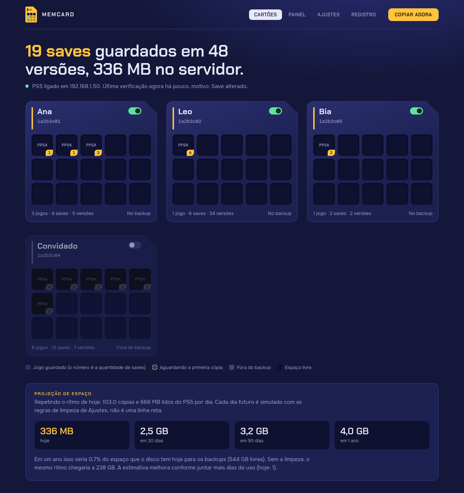

<p align="center"></p>

# Cartão de Memória

Backup automático e versionado dos saves de um PS5 com jailbreak para um
computador da sua rede, com interface web.



*Dados de exemplo. No uso real, cada bloco mostra o ícone do jogo.*

- **Somente leitura no PS5.** Só lista e baixa arquivos pelo FTP do console. Nada é gravado, apagado ou restaurado nele.
- **Todos os perfis**, cada um ligado ou desligado com um toque.
- **Histórico de versões** de cada save, com checksum, para voltar no tempo.
- **Limpeza que não destrói o passado:** versões antigas são rareadas, não zeradas, e passam por uma lixeira.
- **Avisos no Discord sem enxurrada:** uma mensagem por sessão de jogo, editada no lugar.
- **Sem dependências:** um container Python só com a biblioteca padrão.

> Este projeto serve para guardar os **seus próprios saves**. Ele não copia jogos
> e não ajuda a desbloquear o console.

## O que você precisa

1. Um PS5 já desbloqueado, com o payload **ftpsrv**
   ([ps5-payload-dev/ftpsrv](https://github.com/ps5-payload-dev/ftpsrv)) rodando
   (porta 2121). A maioria dos pacotes de payloads já o carrega.
2. Um computador sempre ligado na mesma rede (servidor, notebook, mini PC, NAS)
   com **Docker** e **Docker Compose**.
3. O IP do PS5 fixo no roteador (reserva de DHCP), para ele não mudar.

Para restaurar um save você também vai querer o
[Garlic SaveMgr](https://git.etawen.dev/earthonion/garlic-savemgr) no PS5.

## Instalação

```sh
git clone https://github.com/bps2414/cartao-de-memoria.git
cd cartao-de-memoria
cp config.example.toml config.toml
cp .env.example .env
```

Abra o `config.toml` e troque `host` pelo IP do seu PS5. Depois:

```sh
docker compose up -d --build
```

Abra `http://<ip-do-computador>:8765`. Com o PS5 ligado e o ftpsrv carregado, a
primeira cópia acontece sozinha em menos de um minuto.

Os backups ficam na pasta `data/`, ao lado do projeto. Para guardar em outro
disco, mude `BACKUP_DIR` no `.env`.

## Usando a interface

**Cartões.** Cada perfil do PS5 é um cartão de memória e cada jogo é um bloco.
O número no bloco é quantos saves aquele jogo tem (um jogo costuma gravar vários
arquivos: perfil, sistema, cada slot). O interruptor do cartão tira ou coloca o
perfil no backup. Clique num bloco para ver os saves do jogo, o histórico de
cada um, baixar, fixar uma versão ou tirar o jogo do backup.

**Ajustes.** Tudo é configurável ali e vale na hora, sem reiniciar: gatilhos,
regras de limpeza, avisos e endereço do console. A interface regrava o
`config.toml`; editar o arquivo à mão também funciona.

**Projeção de espaço.** Abaixo dos cartões, o painel estima quanto os backups
vão ocupar em 30 dias, 90 dias e 1 ano. O cálculo repete o ritmo real de cópias
dos últimos dias e simula cada dia futuro com as suas regras de limpeza.

**Painel.** Um mapa de quando o console foi usado (por hora, nos últimos 14
dias, com filtro por perfil), o tempo de jogo estimado por jogo, o espaço que
cada jogo ocupa e a curva de espaço projetada para 12 meses. O tempo de jogo é
medido pelos momentos em que o jogo gravou saves, então é uma estimativa por
baixo.

**Registro.** Cópias recentes, conferência de integridade e o log do serviço.

## Quando a cópia acontece

| Gatilho | O que faz |
|---|---|
| Save alterado | Olha os saves a cada 30 s e copia quando um muda e fica igual por duas leituras seguidas. |
| PS5 ligou | Copia assim que o ftpsrv responde depois do desbloqueio. |
| Agendamento | Conferência completa por intervalo ou em horários fixos, com o PS5 ligado. |
| Manual | Botão **Copiar agora** ou `docker compose exec ps5-backup ps5backup backup`. |

### E quando o PS5 desliga?

Com o console desligado ou em repouso não existe nada rodando nele para ler os
saves, então **não há como fazer backup "ao desligar"**. O que resolve é o
gatilho de save alterado: quando o console cai, a cópia já foi feita. O que for
gravado no último minuto antes de desligar entra na próxima vez que ele ligar.

O jailbreak atual não sobrevive a um desligamento completo. Até você rodar o
desbloqueio de novo, o PS5 aparece como desligado, e isso é esperado.

## Perfis novos

Quando um perfil novo aparece no console, ele segue a regra de
**Ajustes › Perfis e jogos**: entra no backup sozinho (padrão) ou fica de fora
até você decidir. Nos dois casos você é avisado e ele ganha a etiqueta "novo".
Desligar um perfil não apaga as versões que já estavam guardadas.

## Quanto espaço isso ocupa

Alguns jogos regravam o save a cada minuto (medido: ~17 vezes por hora, 6 MB
cada, em 5 arquivos, o que daria uns 500 MB por hora de jogo). Guardar tudo
encheria o disco; apagar por idade deixaria você sem o save de meses atrás. A
solução tem duas etapas.

**Durante o jogo:** a cópia mais recente é sempre guardada, mas só fica uma
versão a cada 10 minutos. As intermediárias são substituídas pela seguinte.
Você não perde nada ao desligar; só deixa de acumular uma versão por minuto.

**Com o tempo:** as versões antigas são rareadas, nunca zeradas.

| Idade da versão | O que fica |
|---|---|
| Última hora | Todas (uma a cada 10 min) |
| Até 2 dias | A última de cada hora |
| Até 14 dias | A última de cada dia |
| Até 12 semanas | A última de cada semana |
| Mais velho que isso | A última de cada mês, sem prazo |

Travas de segurança:

- A limpeza só mexe na pasta de backup. No PS5 nada é apagado nem alterado.
- As 3 versões mais novas de cada save nunca saem.
- Versões **fixadas** nunca saem. Fixe o save de antes de um chefe, de um final, de uma decisão.
- Versões com mais de 2 dias, quando rareadas, vão para `data/trash/` e só são
  apagadas de vez depois de 7 dias. Para recuperar, mova a pasta de volta para o
  mesmo caminho em `data/saves/`.
- Os limites de espaço (tamanho dos backups e espaço livre no disco) **só avisam**. Nunca apagam nada.
- Desligar um perfil ou um jogo, ou o save sumir do console, não apaga nada.

Projeção para um save de 6 MB regravado 17 vezes por hora, 3 horas por dia:

| | Sem limpeza | Com as regras padrão |
|---|---|---|
| 30 dias | 9 GB | 0,26 GB |
| 200 dias | 61 GB | 0,34 GB |

Um jogo com 5 saves assim fica em torno de 1,7 GB enquanto é jogado todo dia, e
encolhe depois que você para de jogar. Comprimir não ajuda: as imagens são
criptografadas (ganho medido de 1 a 2%).

Todos os números são ajustáveis em **Ajustes › Quanto guardar**, que também
mostra quanto cada jogo ocupa e quanto resta no disco.

## Avisos no Discord

Em **Ajustes › Avisos no Discord**, cole a URL de um webhook do seu canal e
toque em **Enviar teste**. Quando o PS5 liga chega uma mensagem, que é editada
em silêncio a cada cópia (o Discord não notifica edições). Quando ele desliga,
ela é trocada por um resumo da sessão: duração, jogos, cópias e espaço total.
São dois avisos por sessão. Falhas repetidas geram no máximo um aviso por hora.

O webhook fica em `data/secrets.json`, fora do repositório. Qualquer outra URL
recebe um POST de texto simples (serve para ntfy, por exemplo).

## Restaurar um save

O projeto nunca escreve no PS5. Restaurar é sempre uma ação sua:

1. Na interface, abra o save e baixe a versão desejada.
2. Abra o Garlic SaveMgr (`http://<ip-do-ps5>:8082`), aba **Import**, escolha o
   perfil de destino e envie o arquivo `sdimg_...`.
3. O Garlic compara a conta do save com a do perfil e oferece o resign se for outra.

O save de PS5 é uma imagem criptografada única. Restaurar no mesmo console é o
caso garantido; em outro console não foi verificado.

## Onde ficam os arquivos

```
data/
  saves/<perfil>/<TITLE_ID>/<arquivo>/<data-hora>/<arquivo>    imagem do save
  saves/<perfil>/<TITLE_ID>/<arquivo>/<data-hora>/meta.json    sha256, jogo, perfil, gatilho
  trash/...                                                    versões rareadas, aguardando o prazo
  cache/art/<TITLE_ID>/                                        ícone e arte do jogo
  state.json  backup.log  secrets.json
```

São arquivos comuns: dá para copiar a pasta inteira para outro disco ou nuvem.

## Linha de comando

```sh
docker compose logs -f ps5-backup                          # acompanhar
docker compose exec ps5-backup ps5backup status            # estado
docker compose exec ps5-backup ps5backup backup            # copiar agora
docker compose exec ps5-backup ps5backup list              # saves e caminho da última versão
docker compose exec ps5-backup ps5backup verify            # conferir checksums
docker compose exec ps5-backup ps5backup verify --remote   # comparar com o PS5 ao vivo
docker compose exec ps5-backup ps5backup prune             # aplicar a limpeza agora
```

## Segurança

- A interface **não tem senha**. Use só na rede local e não encaminhe a porta
  8765 no roteador.
- O ftpsrv do PS5 também não tem senha e dá acesso de escrita ao console para
  qualquer aparelho da rede. Este projeto só usa os comandos de leitura
  (`CWD`, `MLSD`, `RETR`).

## Problemas comuns

| Sintoma | O que verificar |
|---|---|
| "PS5 desligado" com o console ligado | O desbloqueio foi rodado depois de ligar? O ftpsrv está carregado? Teste `nc -vz <ip-do-ps5> 2121`. |
| Nenhum perfil aparece | Confira o IP em Ajustes › Console e toque em Copiar agora. |
| Jogo aparece só com o ID | O console não tem os metadados dele (comum em jogos de PS4). O backup funciona igual. |
| Save fica "aguardando" por muito tempo | O jogo está regravando sem parar; ele é copiado assim que estabiliza. |

## Como funciona por dentro

A cada ciclo o serviço lista `/user/home/<perfil>/savedata_prospero/<jogo>/`
(e `savedata/` para PS4) pelo FTP, compara tamanho e data com a última leitura,
baixa só o que mudou e confere, relistando, que o arquivo não mudou durante a
cópia. Nomes e artes vêm de `/user/appmeta` e do banco de saves do console.
Testado com ftpsrv v0.21.1 no firmware 13.42.

## Próximos passos

Veja o [ROADMAP](ROADMAP.md), incluindo a avaliação de um payload próprio.

## Licença

MIT. Veja [LICENSE](LICENSE).
