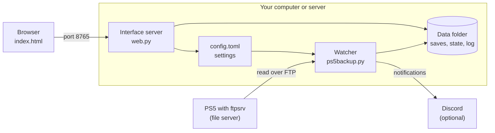

# How Memcard works inside

**English** · [Português](arquitetura.md) · [Back to the README](../README.en.md)

This document explains the whole project, from the network cable to the button
in the interface. It is written for someone who has never opened the code.
When a technical term appears, the next sentence says what it means.

## The idea in one paragraph

Memcard is a program that stays running on a computer in your home. Every few
seconds it asks whether the PS5 is on the network. When the console answers,
Memcard lists the save files, copies the ones that changed and stores each copy
in a folder named with the date and time. The PS5 never receives anything.
Memcard only reads.

## The parts



There are four parts.

**The PS5.** The console runs `ftpsrv`, a program that is not part of Memcard.
It exposes the PS5's files over the network using FTP, an old file transfer
protocol. Memcard sees the saves through it.

**The watcher.** It is the core of the project and lives in
`app/ps5backup.py`. It runs without stopping, decides when to copy, makes the
copy and thins out old versions. The code calls this mode `daemon`, the name
programmers give to a program that keeps running in the background.

**The interface server.** It lives in `app/web.py`. It serves the page you open
in the browser and answers the page's clicks. It runs inside the same program
as the watcher, in parallel.

**The page.** It is a single file, `app/ui/index.html`, holding the layout, the
text in both languages and the behavior. It runs in your browser and talks to
the interface server.

Discord is optional. If you set up a webhook, which is an address a program
sends messages to, the watcher tells you when the PS5 turns on, when it copies
saves and when something fails.

## Rules the project does not break

These rules explain many decisions in the code.

1. **The PS5 is read-only.** Memcard uses only FTP commands that log in, list
   and download: `USER`, `PASS`, `CWD`, `PWD`, `TYPE`, `PASV`, `MLSD`, `RETR`,
   `FEAT`, `SYST` and `QUIT`. None of them writes, deletes or renames. A bug in
   Memcard has no way to damage a save on the console.
2. **No third-party libraries.** The program uses only what ships with Python.
   This reduces what can break in an update and what you have to trust.
3. **Restoring is manual.** Putting a save back on the console would require
   writing to the PS5. Memcard hands you the file and you import it with
   another tool, Garlic SaveMgr. The procedure is in
   [restore.en.md](restore.en.md).
4. **Cleanup never deletes by surprise.** Old versions go through a trash
   folder before they disappear, and versions you pinned never leave.

## The watcher's cycle

The watcher repeats the same cycle every 10 seconds, a value you can change in
`probe_interval_seconds`.

1. It rereads `config.toml`. This is why a setting changed in the interface
   applies on the next cycle, with no restart.
2. It tries to open a connection to the PS5. If the connection opens, the
   console is on.
3. With the console on, it picks one of three actions, explained below.
4. With the console off, it counts the failures and, when needed, looks for
   the PS5 at another address.
5. It sleeps until the next cycle.

### When it copies

Every copy has a reason, which the code calls a trigger. The reason appears in
the history of each version.

| Trigger | When it happens |
|---|---|
| PS5 turned on | The console appeared on the network. The watcher waits 20 seconds for the system to finish starting and runs a full pass. |
| Save changed | Every 30 seconds the watcher compares the size and date of the saves with what it already has. If something changed, it copies. |
| Scheduled | Every 6 hours, or at the times you set, it runs a full checking pass. |
| Manual | You clicked **Back up now** or ran the `backup` command. |

The "save changed" trigger exists because of a physical limit. With the PS5
off or in rest mode nothing can be read. The save has to be copied before the
console leaves the network, so the watcher copies soon after the game writes.

### How it knows the console turned off

One failed connection is not enough, because Wi-Fi drops. The watcher treats
the PS5 as off the network only after 3 attempts in a row with no answer. Even
then it waits another 180 seconds before notifying Discord. If the console
comes back in that window, the watcher treats it as a short drop and sends no
message.

### How it finds the console

The PS5's network address can change when the router restarts. If the console
does not answer and automatic search is on, the watcher scans the network
every 5 minutes. It tests ports `2121`, `1337` and `21` on each address in the
range and confirms it is a PS5 by trying to enter the `/user/home` folder.
When it finds the console, it writes the new address to `config.toml`.

Inside Docker the program sees an internal network, different from your home
network. So the search first tries the range of the configured address and
then the ranges `192.168.1.x` and `192.168.0.x`, common on home routers. If
none of that works, you set the range in `subnet`.

## One backup pass, step by step

The function `run_backup` does the work. It follows this order.

1. **Lock.** It takes a lock, a `.lock` file that only one process can hold at
   a time. The watcher, the interface and the command line never copy at the
   same time.
2. **List.** It walks `/user/home` on the PS5. Each folder with 8 hexadecimal
   characters is a profile. Inside the profile, `savedata_prospero` holds PS5
   saves and `savedata` holds PS4 saves. Each game is a folder with a code
   such as `PPSA00001`.
3. **Filter.** Profiles and games you turned off stay in the list, so the
   interface can show them, but the watcher does not download them.
4. **Compare.** For each file, it compares size and date with the last copy.
   If both match, the file did not change and it moves on.
5. **Wait for the file to settle.** On the "save changed" trigger, the file
   must look the same in two scans in a row. This avoids copying a save while
   the game is still writing to it.
6. **Download.** It downloads the file to a temporary folder and computes the
   SHA-256 during the download. SHA-256 is a 64-character fingerprint. Two
   files with the same fingerprint have the same content.
7. **Check again.** After the download it lists the file once more. If the
   size or date changed, the game wrote in the middle of the copy. It tries up
   to 3 times and, if that fails, leaves the file for the next pass.
8. **Drop duplicates.** If the fingerprint equals the last version's, only the
   date changed. It creates no new version.
9. **Store.** It moves the file into a folder named with the date and time and
   writes a `meta.json` next to it with the profile, game, size, fingerprint
   and trigger.
10. **Record and clean.** It updates the state, writes to the log and applies
    retention, described further down.

On a full pass it also reads the profile names, each game's name and cover
art, and the PS5 database that gives each save its title. This is why the
interface shows "A aventura de João" instead of `sdimg_slot`.

## Where everything is stored

Memcard uses no database. Everything is in ordinary files inside the data
folder, which you can open, copy and take to another computer.

```
data/
  saves/
    1a2b3c4d/                  profile
      PPSA00001/               game
        sdimg_slot/            one save file
          20261006-135023/     one version, with date and time
            sdimg_slot         the copy
            meta.json          the version's record
            PINNED             exists only if you pinned the version
  trash/                       versions removed by cleanup, waiting out the delay
  cache/art/                   game covers
  state.json                   what the watcher knows: profiles, games, last copy
  stats.json                   activity per day, used by the Dashboard
  secrets.json                 the webhook address
  backup.log                   the log
  .lock                        the lock
```

`config.toml` sits outside this folder. It holds the settings, and the
interface rewrites it when you save. The webhook address is in `secrets.json`,
away from the settings file, so you can share `config.toml` without exposing
the address.

The program writes each state file in two steps. It first writes a temporary
file, then swaps it for the final one. If the power fails halfway, the old
file is still whole.

## Retention: what stays and what goes

A game that writes every minute would produce thousands of versions. Retention
keeps many recent versions and few old ones. The function `versions_to_keep`
decides what stays, with the default values below.

| Age of the version | What stays |
|---|---|
| Up to 1 hour | All of them |
| Up to 2 days | The last one of each hour |
| Up to 14 days | The last one of each day |
| Up to 12 weeks | The last one of each week |
| Older | The last one of each month, forever |

Two protections override the table. The 3 newest versions of each save always
stay. Pinned versions never leave.

There is also a minimum gap of 10 minutes. The newest copy is always stored,
but if the previous one is less than 10 minutes apart from the one before it,
the previous one is replaced.

Versions older than 2 days that cleanup removes go to `trash/` and disappear
only after 7 days. Going over the space limit never deletes anything. Memcard
only warns you.

## Integrity check

Disks fail silently. Every 7 days the watcher rereads every stored version,
recomputes its fingerprint and compares it with the record. If one does not
match, it warns you in the interface and on Discord. This check does not need
the PS5 to be on.

## The interface

### The server

`web.py` uses the HTTP server that ships with Python and listens on port 8765.
It does three things. It serves the page, serves the save files for download
and answers requests for data, which programmers call an API.

| Address | What it does |
|---|---|
| `GET /api/overview` | Returns everything the page shows: profiles, games, versions, PS5 state and settings |
| `GET /api/stats` | Dashboard data |
| `GET /api/log` | The last lines of the log |
| `GET /api/diag` | The compatibility diagnostics |
| `POST /api/backup` | Starts a backup |
| `POST /api/discover` | Looks for the PS5 on the network |
| `POST /api/config` | Saves the settings |
| `POST /api/profile`, `/api/title` | Turns a profile or a game on or off |
| `POST /api/pin` | Pins or unpins a version |
| `POST /api/webhook`, `/api/webhook/test` | Saves and tests the Discord notification |
| `POST /api/verify` | Runs the integrity check |
| `POST /api/setup` | Marks the first-run wizard as done |

The server validates each part of a download address against a list of allowed
characters. This stops a malformed address from reading files outside the
saves folder.

### The page

The page requests `/api/overview` every 4 seconds and redraws what changed. It
has four tabs. **Cards** shows one card per profile and one block per game.
**Dashboard** shows space usage and play time. **Settings** edits
`config.toml`. **Log** shows what the watcher did.

On first open, a three-step wizard finds the PS5, runs the first backup and
sets up Discord. The server tells the page whether to show the wizard through
the `setup` field.

### Password

The password is optional and comes from the `WEB_PASSWORD` variable. With it
set, pages, API and downloads require login. A login lasts 30 days. Five wrong
passwords from the same address block new attempts for 5 minutes.

The server stores no sessions on disk. It signs the expiry date with a key
derived from the password and hands the result to the browser. Changing the
password invalidates every login.

The interface is built for the home network. It does not use HTTPS. Do not
expose port 8765 to the internet.

## Discord notifications

The watcher keeps one message per play session, not one message per copy. It
creates the message when the PS5 turns on, edits the same message on each copy
and replaces it with a summary when the console turns off. Edits do not
trigger a notification on your phone.

Errors have a 60-minute gap between notifications, so a repeated failure does
not flood the channel. Every Monday morning a weekly summary goes out with
play time per profile and the space used.

## The Dashboard and the space projection

`app/projection.py` estimates how much space the backups will take in 30, 90
and 365 days. It reads the copy rate of the last 7 days from the log, repeats
that rate day by day and applies the same retention rules the watcher uses.
The result accounts for old versions leaving over time, which a
straight-line estimate would ignore.

Play time is an estimate. Memcard does not know when you play. It knows at
which moments the PS5 wrote saves and counts the 10-minute slots that had a
write.

## Two languages

The text lives in two dictionaries. `app/i18n.py` holds the messages for the
server, Discord and the command line. `index.html` holds the page's text. Every
key exists in Portuguese and in English, and a test fails if a key is missing
in one language.

## Two ways to run it

**Docker.** The `Dockerfile` builds a small image with Python and the `app`
folder. `compose.yml` connects that image to the data folder and to
`config.toml`. It also includes Watchtower, which checks every 15 minutes for a
new image and updates on its own.

**Windows.** `memcard.exe` is the same code packaged with PyInstaller. A
double-click starts the watcher and opens the browser. Settings and data sit
next to the executable. In this mode the interface accepts connections only
from the same computer.

The same program accepts commands on the command line.

| Command | What it does |
|---|---|
| `daemon` | Starts the watcher and the interface |
| `backup` | Runs a backup now |
| `status` | Shows the state of the PS5 and of the last backup |
| `discover` | Looks for the PS5 and writes the address |
| `diag` | Produces the compatibility diagnostics |
| `list` | Lists the stored saves |
| `verify` | Checks the integrity of the versions |
| `prune` | Applies retention now |

## Code map

| File | Lines | Role |
|---|---|---|
| `app/ps5backup.py` | about 1,500 | Watcher, copying, retention, integrity check, Discord, PS5 search and commands |
| `app/web.py` | about 370 | Interface server, API, login and downloads |
| `app/ui/index.html` | about 1,200 | The whole page |
| `app/ui/login.html` | small | The password screen |
| `app/i18n.py` | about 230 | Server text in both languages |
| `app/projection.py` | about 115 | Space projection |
| `app/memcard.py` | 3 | Entry point of the executable |
| `config.example.toml` | | Settings template, with an explanation of each one |
| `compose.yml`, `Dockerfile` | | How to run in Docker |

## Tests

The tests are in `tests/` and use only Python.

`tests/fake_ps5.py` is a fake PS5. It speaks FTP, keeps sample files in memory
and rejects every write command. The backup tests run against it, so they
exercise the real path without a console.

| File | What it checks |
|---|---|
| `test_backup.py` | A backup pass from start to finish |
| `test_retention.py` | That cleanup never removes what must stay |
| `test_verify.py` | The integrity check |
| `test_discover.py` | The PS5 network search |
| `test_diag.py` | The diagnostics and what they hide for privacy |
| `test_web.py` | The API, the login and the wizard |
| `test_notify.py` | The Discord messages |
| `test_projection.py` | The space projection |
| `test_config.py` | Settings validation and the version in the CHANGELOG |
| `test_ui.py`, `check_ui.js` | That the page has every text in both languages |
| `test_windows_exe.py` | The executable's behavior |

To run everything:

```bash
python -m unittest discover -s tests -v
```

## How a version reaches you

GitHub runs three automatic jobs, defined in `.github/workflows/`.

- `tests.yml` runs the tests on every code push.
- `publish.yml` runs on every change to the main branch. It tests, builds the
  Docker image and publishes it to `ghcr.io/bps2414/memcard:latest`.
- `release.yml` runs when a version gets a tag such as `v0.7.0`. It tests,
  builds `memcard.exe` and attaches it to the version's page, together with
  the file's SHA-256.

The version number is in `VERSION`, inside `app/ps5backup.py`, and has to match
the top of the [CHANGELOG](../CHANGELOG.en.md). A test checks this.

## Known limits

- With the PS5 off or in rest mode nothing can be read. What the game wrote
  after the last scan is copied only when the console comes back.
- Memcard depends on `ftpsrv` running on the console. The
  [compatibility table](COMPATIBILITY.en.md) lists the tested combinations.
- Restoring has not yet been exercised end to end on a real console. The state
  of that work is in [restore.en.md](restore.en.md).
- The interface has no HTTPS and is meant for the local network.
