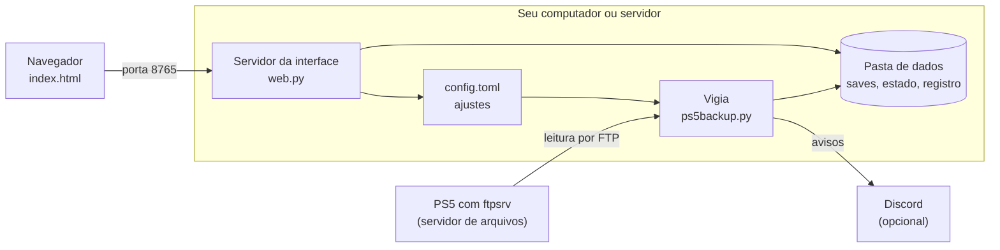

# Como o Memcard funciona por dentro

**Português** · [English](architecture.en.md) · [Voltar ao README](../README.md)

Este documento explica o projeto inteiro, do cabo de rede até o botão da
interface. Ele foi escrito para quem nunca abriu o código. Quando um termo
técnico aparece, a frase seguinte diz o que ele significa.

## A ideia em um parágrafo

O Memcard é um programa que fica ligado em um computador da sua casa. A cada
poucos segundos ele pergunta se o PS5 está na rede. Quando o console responde,
o Memcard lista os arquivos de save, copia os que mudaram e guarda cada cópia
em uma pasta com data e hora. O PS5 nunca recebe nada. O Memcard só lê.

## As peças



São quatro peças.

**O PS5.** No console roda o `ftpsrv`, um programa que não faz parte do
Memcard. Ele expõe os arquivos do PS5 pela rede usando FTP, um protocolo
antigo de transferência de arquivos. É por ele que o Memcard enxerga os saves.

**O vigia.** É o coração do projeto e mora em `app/ps5backup.py`. Ele roda sem
parar, decide quando copiar, faz a cópia e limpa versões antigas. O código
chama esse modo de `daemon`, nome que programadores dão a um programa que fica
rodando em segundo plano.

**O servidor da interface.** Mora em `app/web.py`. Ele entrega a página que
você abre no navegador e responde aos cliques dela. Roda dentro do mesmo
programa que o vigia, em paralelo.

**A página.** É um arquivo só, `app/ui/index.html`, com o desenho, os textos
nos dois idiomas e o comportamento. Ela roda no seu navegador e conversa com o
servidor da interface.

O Discord é opcional. Se você configurar um webhook, que é um endereço para
onde um programa manda mensagens, o vigia avisa quando o PS5 liga, quando
copia saves e quando algo falha.

## Regras que o projeto não quebra

Estas regras explicam muitas decisões do código.

1. **O PS5 é somente leitura.** O Memcard usa apenas comandos FTP de entrar,
   listar e baixar: `USER`, `PASS`, `CWD`, `PWD`, `TYPE`, `PASV`, `MLSD`,
   `RETR`, `FEAT`, `SYST` e `QUIT`. Nenhum deles grava, apaga ou renomeia. Um
   defeito no Memcard não tem como estragar um save no console.
2. **Sem bibliotecas de terceiros.** O programa usa só o que vem com o Python.
   Isso reduz o que pode quebrar em uma atualização e o que você precisa
   confiar.
3. **Restaurar é manual.** Devolver um save ao console exigiria gravar no PS5.
   O Memcard entrega o arquivo e você o importa com outra ferramenta, o Garlic
   SaveMgr. O roteiro está em [restaurar.md](restaurar.md).
4. **Limpar nunca é apagar de surpresa.** Versões antigas passam por uma
   lixeira antes de sumir, e versões fixadas por você nunca saem.

## O ciclo do vigia

O vigia repete o mesmo ciclo a cada 10 segundos, valor que você pode mudar em
`probe_interval_seconds`.

1. Ele relê o `config.toml`. Por isso um ajuste feito na interface vale no
   ciclo seguinte, sem reiniciar nada.
2. Ele tenta abrir uma conexão com o PS5. Se abrir, o console está ligado.
3. Com o console ligado, ele escolhe uma de três ações, explicadas abaixo.
4. Com o console desligado, ele conta as falhas e, se for o caso, procura o
   PS5 em outro endereço.
5. Ele dorme até o próximo ciclo.

### Quando ele copia

Cada cópia tem um motivo, que o código chama de gatilho. O motivo aparece no
histórico de cada versão.

| Gatilho | Quando acontece |
|---|---|
| PS5 ligou | O console apareceu na rede. O vigia espera 20 segundos para o sistema terminar de subir e faz uma rodada completa. |
| Save alterado | A cada 30 segundos o vigia compara tamanho e data dos saves com o que já tem. Se algo mudou, ele copia. |
| Agendado | A cada 6 horas, ou nos horários que você definir, ele faz uma rodada completa de conferência. |
| Manual | Você clicou em **Copiar agora** ou rodou o comando `backup`. |

O gatilho "save alterado" existe por causa de um limite físico. Com o PS5
desligado ou em repouso não há como ler nada. O save precisa estar copiado
antes de o console sair da rede, então o vigia copia logo depois que o jogo
grava.

### Como ele sabe que o console desligou

Uma falha de conexão não basta, porque o Wi-Fi oscila. O vigia só considera o
PS5 fora da rede depois de 3 tentativas seguidas sem resposta. Mesmo assim ele
espera mais 180 segundos antes de avisar no Discord. Se o console voltar nesse
intervalo, o vigia trata como queda rápida e não manda mensagem.

### Como ele acha o console

O endereço do PS5 na rede pode mudar quando o roteador reinicia. Se o console
não responde e a busca automática está ligada, o vigia varre a rede a cada 5
minutos. Ele testa as portas `2121`, `1337` e `21` em cada endereço da faixa e
confirma que é um PS5 tentando entrar na pasta `/user/home`. Quando acha,
grava o novo endereço no `config.toml`.

Dentro do Docker o programa enxerga uma rede interna, diferente da rede da sua
casa. Por isso a busca tenta primeiro a faixa do endereço já configurado e
depois as faixas `192.168.1.x` e `192.168.0.x`, comuns em roteadores
domésticos. Se nada disso servir, você informa a faixa em `subnet`.

## Uma rodada de cópia, passo a passo

A função `run_backup` faz o trabalho. Ela segue esta ordem.

1. **Trava.** Ela pega uma trava, um arquivo `.lock` que só um processo segura
   por vez. Assim o vigia, a interface e a linha de comando nunca copiam ao
   mesmo tempo.
2. **Lista.** Ela percorre `/user/home` no PS5. Cada pasta com 8 caracteres
   hexadecimais é um perfil. Dentro do perfil, `savedata_prospero` guarda os
   saves de PS5 e `savedata` guarda os de PS4. Cada jogo é uma pasta com um
   código como `PPSA00001`.
3. **Filtra.** Perfis e jogos que você desligou continuam na lista, para a
   interface mostrá-los, mas o vigia não os baixa.
4. **Compara.** Para cada arquivo, ela compara tamanho e data com a última
   cópia. Se os dois são iguais, o arquivo não mudou e ela segue adiante.
5. **Espera estabilizar.** No gatilho "save alterado", o arquivo precisa
   aparecer igual em duas varreduras seguidas. Isso evita copiar um save
   enquanto o jogo ainda escreve nele.
6. **Baixa.** Ela baixa o arquivo para uma pasta temporária e calcula o
   SHA-256 durante o download. O SHA-256 é uma impressão digital de 64
   caracteres. Dois arquivos com a mesma impressão têm o mesmo conteúdo.
7. **Confere de novo.** Depois do download ela lista o arquivo outra vez. Se o
   tamanho ou a data mudaram, o jogo gravou no meio da cópia. Ela tenta até 3
   vezes e, se não der, deixa para a próxima rodada.
8. **Descarta duplicata.** Se a impressão digital é igual à da última versão,
   só a data mudou. Ela não cria versão nova.
9. **Guarda.** Ela move o arquivo para uma pasta com data e hora e grava ao
   lado um `meta.json` com perfil, jogo, tamanho, impressão digital e gatilho.
10. **Anota e limpa.** Ela atualiza o estado, escreve no registro e aplica a
    retenção, descrita mais abaixo.

Em uma rodada completa ela também lê os nomes dos perfis, o nome e a capa de
cada jogo e o banco de dados do PS5 que dá título a cada save. É por isso que a
interface mostra "A aventura de João" em vez de `sdimg_slot`.

## Onde tudo fica guardado

O Memcard não usa banco de dados. Tudo fica em arquivos comuns dentro da pasta
de dados, que você pode abrir, copiar e levar para outro computador.

```
data/
  saves/
    1a2b3c4d/                  perfil
      PPSA00001/               jogo
        sdimg_slot/            um arquivo de save
          20261006-135023/     uma versão, com data e hora
            sdimg_slot         a cópia
            meta.json          a ficha da versão
            PINNED             existe só se você fixou a versão
  trash/                       versões que a limpeza tirou, à espera do prazo
  cache/art/                   capas dos jogos
  state.json                   o que o vigia sabe: perfis, jogos, última cópia
  stats.json                   atividade por dia, usada no Painel
  secrets.json                 o endereço do webhook
  backup.log                   o registro
  .lock                        a trava
```

O `config.toml` fica fora dessa pasta. Ele guarda os ajustes e a interface o
regrava quando você salva. O endereço do webhook fica em `secrets.json`, longe
do arquivo de ajustes, para você poder compartilhar o `config.toml` sem expor
o endereço.

O programa grava cada arquivo de estado em dois passos. Primeiro escreve um
arquivo temporário, depois o troca pelo definitivo. Se a energia cair no meio,
o arquivo antigo continua inteiro.

## Retenção: o que fica e o que sai

Um jogo que grava a cada minuto geraria milhares de versões. A retenção mantém
muitas versões recentes e poucas antigas. A função `versions_to_keep` decide o
que fica, com os valores padrão abaixo.

| Idade da versão | O que fica |
|---|---|
| Até 1 hora | Todas |
| Até 2 dias | A última de cada hora |
| Até 14 dias | A última de cada dia |
| Até 12 semanas | A última de cada semana |
| Mais velha | A última de cada mês, para sempre |

Duas proteções valem acima da tabela. As 3 versões mais novas de cada save
sempre ficam. Versões fixadas nunca saem.

Há também um intervalo mínimo de 10 minutos. A cópia mais recente sempre é
guardada, mas se a anterior tem menos de 10 minutos de diferença da que veio
antes dela, a anterior é substituída.

Versões com mais de 2 dias que a limpeza retira vão para `trash/` e só somem
depois de 7 dias. Passar do limite de espaço nunca apaga nada. O Memcard só
avisa.

## Conferência de integridade

Discos falham em silêncio. A cada 7 dias o vigia relê todas as versões
guardadas, recalcula a impressão digital de cada uma e compara com a ficha. Se
alguma não bate, ele avisa na interface e no Discord. Essa conferência não
precisa do PS5 ligado.

## A interface

### O servidor

`web.py` usa o servidor HTTP que vem com o Python e escuta na porta 8765. Ele
faz três coisas. Entrega a página, entrega os arquivos de save para download e
responde a pedidos de dados, que programadores chamam de API.

| Endereço | O que faz |
|---|---|
| `GET /api/overview` | Devolve tudo o que a página mostra: perfis, jogos, versões, estado do PS5 e ajustes |
| `GET /api/stats` | Dados do Painel |
| `GET /api/log` | As últimas linhas do registro |
| `GET /api/diag` | O diagnóstico de compatibilidade |
| `POST /api/backup` | Começa uma cópia |
| `POST /api/discover` | Procura o PS5 na rede |
| `POST /api/config` | Salva os ajustes |
| `POST /api/profile`, `/api/title` | Liga ou desliga um perfil ou um jogo |
| `POST /api/pin` | Fixa ou solta uma versão |
| `POST /api/webhook`, `/api/webhook/test` | Salva e testa o aviso do Discord |
| `POST /api/verify` | Roda a conferência de integridade |
| `POST /api/setup` | Marca o assistente de primeiro acesso como concluído |

O servidor valida cada parte de um endereço de download contra uma lista de
caracteres permitidos. Isso impede que um endereço malformado leia arquivos
fora da pasta de saves.

### A página

A página pede `/api/overview` a cada 4 segundos e redesenha o que mudou. Ela
tem quatro abas. **Cartões** mostra um cartão por perfil e um bloco por jogo.
**Painel** mostra uso de espaço e tempo de jogo. **Ajustes** edita o
`config.toml`. **Registro** mostra o que o vigia fez.

Na primeira abertura, um assistente de três passos acha o PS5, faz a primeira
cópia e configura o Discord. O servidor diz à página se o assistente deve
aparecer por meio do campo `setup`.

### Senha

A senha é opcional e vem da variável `WEB_PASSWORD`. Com ela definida, páginas,
API e downloads exigem login. O login vale 30 dias. Cinco senhas erradas do
mesmo endereço bloqueiam novas tentativas por 5 minutos.

O servidor não guarda sessões em disco. Ele assina a data de validade com uma
chave derivada da senha e entrega o resultado ao navegador. Trocar a senha
invalida todos os logins.

A interface foi feita para a rede de casa. Ela não usa HTTPS. Não exponha a
porta 8765 à internet.

## Avisos no Discord

Em vez de mandar uma mensagem por cópia, o vigia mantém uma mensagem por
sessão de jogo. Ele cria a mensagem quando o PS5 liga, edita a mesma mensagem
a cada cópia e a troca por um resumo quando o console desliga. Edições não
geram notificação no celular.

Erros têm um intervalo de 60 minutos entre avisos, para uma falha repetida não
encher o canal. Toda segunda de manhã sai um resumo da semana com o tempo de
jogo por perfil e o espaço ocupado.

## O Painel e a projeção de espaço

`app/projection.py` estima quanto espaço os backups vão ocupar em 30, 90 e 365
dias. Ele lê no registro o ritmo de cópias dos últimos 7 dias, repete esse
ritmo dia a dia e aplica as mesmas regras de retenção que o vigia usa. O
resultado considera que versões antigas saem com o tempo, o que uma regra de
três simples ignoraria.

O tempo de jogo é uma estimativa. O Memcard não sabe quando você joga. Ele
sabe em que momentos o PS5 gravou saves e conta os intervalos de 10 minutos
em que houve gravação.

## Dois idiomas

Os textos ficam em dois dicionários. `app/i18n.py` guarda as mensagens do
servidor, do Discord e da linha de comando. `index.html` guarda os textos da
página. Cada chave existe em português e em inglês, e um teste falha se uma
chave faltar em um dos idiomas.

## Duas formas de rodar

**Docker.** O `Dockerfile` monta uma imagem pequena com Python e a pasta
`app`. O `compose.yml` liga essa imagem à pasta de dados e ao `config.toml`.
Ele também traz o Watchtower, que confere a cada 15 minutos se há imagem nova
e atualiza sozinho.

**Windows.** O `memcard.exe` é o mesmo código empacotado com o PyInstaller.
Com dois cliques ele inicia o vigia e abre o navegador. Os ajustes e os dados
ficam ao lado do executável. Nesse modo a interface só aceita conexões do
próprio computador.

O mesmo programa aceita comandos pela linha de comando.

| Comando | O que faz |
|---|---|
| `daemon` | Inicia o vigia e a interface |
| `backup` | Faz uma cópia agora |
| `status` | Mostra o estado do PS5 e da última cópia |
| `discover` | Procura o PS5 e grava o endereço |
| `diag` | Gera o diagnóstico de compatibilidade |
| `list` | Lista os saves guardados |
| `verify` | Confere a integridade das versões |
| `prune` | Aplica a retenção agora |

## Mapa do código

| Arquivo | Linhas | Papel |
|---|---|---|
| `app/ps5backup.py` | cerca de 1.500 | Vigia, cópia, retenção, conferência, Discord, busca do PS5 e comandos |
| `app/web.py` | cerca de 370 | Servidor da interface, API, login e downloads |
| `app/ui/index.html` | cerca de 1.200 | A página inteira |
| `app/ui/login.html` | pequeno | A tela de senha |
| `app/i18n.py` | cerca de 230 | Textos do servidor nos dois idiomas |
| `app/projection.py` | cerca de 115 | Projeção de espaço |
| `app/memcard.py` | 3 | Ponto de entrada do executável |
| `config.example.toml` | | Modelo dos ajustes, com explicação de cada um |
| `compose.yml`, `Dockerfile` | | Como rodar no Docker |

## Testes

Os testes ficam em `tests/` e usam só o Python.

`tests/fake_ps5.py` é um PS5 de mentira. Ele fala FTP, guarda arquivos de
exemplo na memória e rejeita qualquer comando de escrita. Os testes de cópia
rodam contra ele, então exercitam o caminho real sem precisar de um console.

| Arquivo | O que confere |
|---|---|
| `test_backup.py` | Uma rodada de cópia do começo ao fim |
| `test_retention.py` | Que a limpeza nunca tira o que deve ficar |
| `test_verify.py` | A conferência de integridade |
| `test_discover.py` | A busca do PS5 na rede |
| `test_diag.py` | O diagnóstico e o que ele esconde por privacidade |
| `test_web.py` | A API, o login e o assistente |
| `test_notify.py` | As mensagens do Discord |
| `test_projection.py` | A projeção de espaço |
| `test_config.py` | A validação dos ajustes e a versão no CHANGELOG |
| `test_ui.py`, `check_ui.js` | Que a página tem todos os textos nos dois idiomas |
| `test_windows_exe.py` | O comportamento do executável |

Para rodar tudo:

```bash
python -m unittest discover -s tests -v
```

## Como uma versão chega até você

O GitHub roda três rotinas automáticas, definidas em `.github/workflows/`.

- `tests.yml` roda os testes a cada envio de código.
- `publish.yml` roda a cada mudança no ramo principal. Ele testa, monta a
  imagem Docker e a publica em `ghcr.io/bps2414/memcard:latest`.
- `release.yml` roda quando uma versão recebe uma etiqueta como `v0.7.0`. Ele
  testa, gera o `memcard.exe` e o anexa à página da versão, junto com o
  SHA-256 do arquivo.

O número da versão fica em `VERSION`, dentro de `app/ps5backup.py`, e precisa
ser igual ao topo do [CHANGELOG](../CHANGELOG.md). Um teste confere.

## Limites conhecidos

- Com o PS5 desligado ou em repouso não há leitura. O que o jogo gravou depois
  da última varredura só entra quando o console voltar.
- O Memcard depende do `ftpsrv` rodando no console. A
  [tabela de compatibilidade](COMPATIBILIDADE.md) lista as combinações
  testadas.
- A restauração ainda não foi exercitada de ponta a ponta no console real. O
  estado desse trabalho está em [restaurar.md](restaurar.md).
- A interface não tem HTTPS e foi pensada para a rede local.
