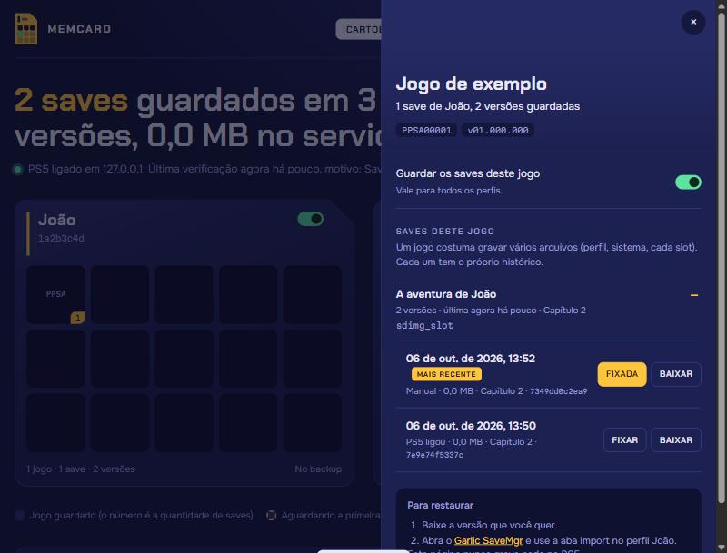

# Restaurar saves de PS5: roteiro de teste e guia em preparação

**Português** · [English](restore.en.md)

O Memcard nunca escreve no PS5. A restauração é uma ação manual do dono pelo
[Garlic SaveMgr](https://git.etawen.dev/earthonion/garlic-savemgr), em
`http://<ip-do-ps5>:8082`, aba **Import**. Este fluxo ainda não foi exercitado de
ponta a ponta no console real. Este documento não certifica que uma restauração
funciona, mesmo no console de origem.

## Parte 1 — roteiro para o dono executar

Use um save descartável de PS5 no console de origem. Faça um caso de cada vez,
com o jogo fechado ao copiar, exportar, importar ou apagar. Não altere arquivos
pelo FTP: ele serve apenas para observar e baixar. As escritas deste roteiro
são feitas manualmente pelo dono no Garlic ou nas telas do PS5.

### O que a leitura do Garlic mostra

Fonte consultada em 05/10/2026: Garlic v1.13, commit
[`c1409a1aea9d4c15461f6e36950a64298b66bfe8`](https://git.etawen.dev/earthonion/garlic-savemgr/commit/c1409a1aea9d4c15461f6e36950a64298b66bfe8).
Referências: `src/ui.html` (seletor de usuário, aba Import, `importEncrypted`,
`importDrop`, `doImportFinish`) e `src/main.c` (rotas abaixo).

- `/api/users` lista o ID local e o nome de cada perfil; não informa o ID de
  conta. O seletor começa no primeiro perfil recebido: confira o destino.
- A aba Import aceita pasta descriptografada ou imagem criptografada. Para a
  imagem `sdimg_...` baixada do Memcard, use **Browse File** ou arraste o arquivo.
  Não use **Browse Folder** nem envie vários saves juntos.
- `POST /api/import_encrypted?uid=...` recebe e monta uma cópia temporária da
  imagem, lê `sce_sys/param.sfo`, verifica se o save existe no destino e compara
  o ID de conta do save com o do perfil. Retorna `save_aid`, `user_aid`, `match`
  e `exists` no caminho normal. `match` só é verdadeiro se o ID do perfil não
  for zero e coincidir; uma oferta de resign sozinha não prova conta diferente.
- A interface pede confirmação se `exists` for verdadeiro. Se `match` for falso,
  mostra os dois IDs e oferece **Yes, Resign**. Aceitar segue para a conclusão
  da importação; não chama `/api/resign`.
- `GET /api/import_check?uid=...` verifica a existência de um save já montado.
  A interface usa essa rota no fluxo de pasta descriptografada; no fluxo
  criptografado, a checagem já vem de `/api/import_encrypted`.
- `GET /api/import_finish?uid=...` lê o ID de conta local; se não for zero,
  regrava o ID de conta e o ID local de usuário no `param.sfo` de PS5. Desmonta
  a imagem, copia para `savedata_prospero/<TITLE_ID>/sdimg_<dir_name>` e tenta
  atualizar/criar a entrada no banco de saves. Há caminhos de erro e aviso;
  a tela de sucesso não substitui abrir o jogo e conferir o progresso.
- `POST /api/resign` pertence à aba Resign: recebe uma imagem e um ID de conta
  informado, altera a cópia e disponibiliza o arquivo para download. Não é
  necessário usar essa aba para o resign oferecido durante Import.
- O Garlic pode regravar e recriptografar a imagem mesmo no mesmo perfil.
  Igualdade do SHA-256 após importar e comportamento do `sdimg_sce_bu_`
  correspondente: **a confirmar no teste**. A rota de conclusão lida com a
  imagem principal; ela não documenta uma sincronização da cópia `sce_bu_`.

Se aparecer aviso de `param.sfo` zerado, regeneração ou **Import Anyway**,
registre e cancele: esse desvio fica **a confirmar no teste**, fora dos três
casos normais abaixo. Não force a importação para completar o roteiro.

### Preparo e duas cópias de segurança

- [ ] Anotar ambiente e escolher um jogo com save descartável.
- [ ] Identificar a versão antiga pelo progresso conhecido e distingui-la do
  save atual. Se ainda não houver duas versões, guardar uma, avançar o jogo,
  fechar e copiar novamente. Fixar ambas antes de continuar.
- [ ] Fechar o jogo e aguardar o fim de qualquer cópia/exportação.
- [ ] No Memcard, executar **Copiar agora**, aguardar a conclusão e conferir
  ausência de falhas. Fixar a versão atual e a antiga escolhida.
- [ ] Baixar ambas para pastas separadas no computador, preservando os nomes.
  Se o jogo exigir vários saves, registrar todos e guardar o conjunto; este
  teste deve usar um save cujo progresso se possa conferir sem misturar slots.
- [ ] No Garlic, conferir perfil, jogo e save e usar **Download Encrypted**
  para exportar o mesmo save atual como segunda rede de segurança. Guardar em
  pasta separada, conferir que o download terminou e anotar o nome que recebeu
  (o Garlic pode acrescentar o TITLE_ID). Se houver outros arquivos necessários
  ao jogo, guardar também. Não depender apenas de uma cópia no próprio PS5.
- [ ] Registrar a presença, tamanho, data e, se possível, SHA-256 do arquivo
  `sdimg_sce_bu_<dir_name>` correspondente, lendo pelo FTP ou pelo Memcard.
  Se não existir, escrever “ausente”; não criar, apagar ou renomear esse arquivo.
- [ ] Conferir que o perfil original e, para o caso C, `Y2jb` e o jogo estão
  incluídos no backup do Memcard. Anotar e depois desfazer mudanças de seleção.
- [ ] Antes de cada caso, repetir **Copiar agora**, fixar/baixar o estado anterior
  e exportá-lo pelo Garlic. Se ele não mudou, identificar as cópias já guardadas.

<!-- PRINT: versões antiga e atual do save no Memcard, com datas e fixação -->
<!-- PRINT: perfil e save selecionados no Garlic antes de Download Encrypted -->
<!-- PRINT: arquivos de segurança baixados no computador, com nomes e tamanhos -->

| Campo | Preencher |
|---|---|
| Data, dono do teste | ____________________ |
| Firmware do PS5 | ____________________ |
| Versão do Garlic instalado (e origem/commit, se conhecido) | ____________________ |
| Versão do Memcard e do ftpsrv | ____________________ |
| Jogo, versão do jogo e TITLE_ID | ____________________ |
| Perfil original, ID local (UID) | ____________________ |
| Save principal (`sdimg_...`) e outros arquivos necessários | ____________________ |
| Versão antiga: data/hora, SHA-256, progresso esperado | ____________________ |
| Versão atual de segurança: data/hora, SHA-256, progresso | ____________________ |
| Pastas locais: antiga / atual / exportação Garlic | ____________________ |
| Cópia `sdimg_sce_bu_...`: caminho, presença, tamanho, data, SHA-256 | ____________________ |
| Seleções do Memcard alteradas para o teste | ____________________ |

### Caso A — mesmo perfil, por cima do save atual

- [ ] Confirmar o save atual no console e as duas cópias de segurança do preparo.
- [ ] Com o jogo fechado, baixar a versão antiga escolhida do Memcard.
- [ ] Abrir o Garlic, selecionar explicitamente o perfil original e a aba
  **Import**. Enviar só a imagem escolhida por **Browse File**.
- [ ] Registrar a confirmação de sobrescrita e aceitá-la apenas se o jogo e
  save mostrados forem os escolhidos. Anotar se houve oferta de resign;
  registrar os IDs mostrados e a escolha feita, sem presumir igualdade de conta.
- [ ] Registrar a tela final, incluindo avisos, e executar a conferência comum.

<!-- PRINT: caso A, perfil de destino e confirmação de sobrescrita -->
<!-- PRINT: caso A, oferta de resign se aparecer e tela final do Garlic -->

Estado anterior/cópias para desfazer: ____________________

Confirmações, IDs de conta, escolha e resultado do Garlic: ____________________

Resultado da conferência comum: ____________________

**Se der errado:** fechar o jogo. No mesmo perfil, importar a imagem atual
fixada/baixada antes do caso, ou a exportação criptografada do Garlic guardada
no computador. Conferir o destino e as confirmações e repetir a conferência no
jogo. Não apagar as versões do Memcard. Se a recuperação também falhar, guardar
mensagens/prints e interromper os outros casos; não editar o banco ou o `sce_bu_`.

Recuperação tentada, arquivo usado e progresso recuperado: ____________________

### Caso B — mesmo perfil, save apagado antes

- [ ] Confirmar ou recuperar o estado de referência após A. Repetir as cópias
  de segurança do preparo antes de apagar qualquer coisa.
- [ ] Com o jogo fechado, apagar manualmente no PS5 somente o save descartável
  do perfil original. Registrar a tela e o que a exclusão removeu; a seleção
  exata disponível no firmware é **a confirmar no teste**. Não usar FTP para apagar.
- [ ] Não abrir o jogo para criar outro save. Observar se a imagem principal e
  o `sdimg_sce_bu_` sumiram; se restou algo, anotar.
- [ ] No Garlic, selecionar o perfil original, aba **Import**, e enviar a mesma
  versão antiga. Anotar se pediu sobrescrita mesmo após a exclusão, se ofereceu
  resign, os IDs visíveis e a tela final. Executar a conferência comum.

<!-- PRINT: caso B, save descartável selecionado para exclusão manual no PS5 -->
<!-- PRINT: caso B, ausência ou arquivos restantes antes de importar -->
<!-- PRINT: caso B, confirmação inesperada se houver e tela final do Garlic -->

Estado anterior/cópias para desfazer: ____________________

Exclusão e arquivos que restaram: ____________________

Confirmações, IDs de conta, escolha e resultado do Garlic: ____________________

Resultado da conferência comum: ____________________

**Se der errado:** não iniciar um novo jogo para substituir o save. Com o jogo
fechado, importar a imagem anterior à exclusão ou a exportação do Garlic no
perfil original, e conferir o progresso. Se não recuperar, interromper o teste
com os arquivos e mensagens preservados. Não manipular o banco ou o `sce_bu_`.

Recuperação tentada, arquivo usado e progresso recuperado: ____________________

### Caso C — perfil `Y2jb`

`Y2jb` é o único outro perfil deste console e ninguém joga nele. Se ele tem
outra conta é **a confirmar no teste**; nome de perfil e UID diferente não
comprovam ID de conta diferente.

- [ ] Com o jogo fechado, registrar o UID de `Y2jb` e se já existe save do jogo
  nele. Se existir, copiar, fixar/baixar e exportar esse save antes de sobrescrever.
  Se não existir, registrar “ausente” como estado anterior.
- [ ] No Garlic, selecionar explicitamente **Y2jb**, aba **Import**, e enviar
  a versão antiga do perfil original. Confirmar sobrescrita só se for o save
  descartável de destino que acabou de proteger.
- [ ] Se oferecer resign, fotografar os dois IDs e aceitar **Yes, Resign**.
  Se não oferecer, anotar isso e os IDs de conta que o Garlic informa para o
  save/perfil original e para `Y2jb`. Não inventar um ID nem mudar para a aba Resign.
- [ ] Se os IDs não aparecerem na tela, abrir as ferramentas do navegador,
  aba Rede/Network, antes do envio e registrar `save_aid`, `user_aid` e `match`
  da resposta de `/api/import_encrypted` nos casos A e C. Não executar rotas à
  mão. `/api/users` fornece UIDs, não IDs de conta. Se a resposta não trouxer
  os campos, preencher “não exibido; a confirmar no teste”.
- [ ] Registrar tela final e avisos. Entrar no **Y2jb no próprio PS5** para abrir
  o jogo e executar a conferência comum. Conferir também que o save do perfil
  original não foi alterado por esta importação.

<!-- PRINT: caso C, Y2jb selecionado no Garlic antes do envio -->
<!-- PRINT: caso C, oferta de resign com IDs ou resposta import_encrypted no navegador -->
<!-- PRINT: caso C, tela final e jogo aberto pelo perfil Y2jb -->

| Campo | Preencher |
|---|---|
| UID original / UID Y2jb | ____________________ |
| Estado anterior de Y2jb e cópias para desfazer | ____________________ |
| Caso A: `save_aid` / `user_aid` / `match` | ____________________ |
| Caso C: `save_aid` / `user_aid` / `match` | ____________________ |
| Resign oferecido? Escolha? Contas diferentes, iguais ou inconclusivo? | ____________________ |
| Resultado do Garlic / conferência comum / save original preservado | ____________________ |

**Se der errado:** fechar o jogo em `Y2jb`. Se havia save antes, restaurar a
cópia protegida de `Y2jb` ou a exportação do Garlic nesse mesmo perfil e conferir.
Se não havia, apagar manualmente nas telas do PS5 apenas o save de teste criado
em `Y2jb`, registrando o resultado. Não apagar o perfil nem mexer no save original.
Se houver dúvida sobre o destino, interromper e preservar a evidência.

Recuperação/remoção tentada e estado final de Y2jb: ____________________

### Conferência comum — preencher uma ficha para cada caso

- [ ] Antes de abrir o jogo, com a importação terminada, executar **Copiar agora**
  e registrar o arquivo, histórico e SHA-256 resultantes. Fixar a versão criada.
  Essa medição ajuda a separar a regravação do Garlic da gravação posterior do jogo.
- [ ] Abrir o jogo no perfil de destino e confirmar pelo progresso que é a
  versão escolhida (slot, capítulo, tempo, item ou outro sinal conhecido).
  Registrar avisos de save corrompido, perfil incorreto ou progresso diferente.
- [ ] Fechar o jogo, executar **Copiar agora**, aguardar a conclusão e anotar
  se o Memcard contou o arquivo como inalterado ou criou uma versão nova.
  Se o daemon já copiou antes do botão, registrar horário/gatilho dessa versão.
- [ ] Comparar o SHA-256 guardado após a importação com o da imagem antiga
  enviada e com o último backup antes do caso. Uma versão nova significa
  diferença em relação ao último conteúdo guardado naquele perfil/arquivo;
  voltar a um save antigo pode criar versão mesmo com SHA igual ao antigo.
  No primeiro save de `Y2jb`, sem backup anterior, esperar primeira cópia, não
  uma deduplicação entre perfis. “Inalterado” no resumo isolado não comprova SHA.
- [ ] Registrar o `sdimg_sce_bu_` antes de importar, após importar ainda com jogo
  fechado e após abrir/fechar o jogo: ausente, criado, mantido, alterado ou removido.
  Anotar tamanho, data e SHA-256 disponível. Não tratá-lo como cópia válida de
  recuperação sem testar. Mudança de SHA sozinha não prova perda de progresso.
- [ ] Registrar a tentativa de desfazer, quando necessária, e o estado final.
  Só seguir ao próximo caso se o estado estiver entendido e protegido.

<!-- PRINT: cada caso, progresso carregado no jogo no perfil de destino -->
<!-- PRINT: cada caso, Registro e histórico do Memcard após Copiar agora -->
<!-- PRINT: cada caso, imagem principal e sce_bu_ antes e depois, sem escrita por FTP -->

| Campo — copiar para A, B e C | Preencher |
|---|---|
| Caso / perfil / horário da importação | ____________________ |
| Garlic: sucesso, aviso, erro e mensagem completa | ____________________ |
| Antes de abrir o jogo: Copiar agora, horário/gatilho, resultado, versão, SHA-256 | ____________________ |
| Progresso esperado / observado / avisos do jogo | ____________________ |
| Após fechar o jogo: Copiar agora, horário/gatilho, resultado, versão, SHA-256 | ____________________ |
| SHA após importar igual ao enviado? Igual ao último backup do destino? | ____________________ |
| `sce_bu_` antes / após importar / após jogar: presença, tamanho, data, SHA-256 | ____________________ |
| Arquivos adicionais afetados / prints e logs guardados | ____________________ |
| Desfazer necessário? Resultado / estado final | ____________________ |
| Veredito: passou, falhou ou inconclusivo; motivo | ____________________ |

Ao terminar, preservar as cópias e evidências, desfazer as seleções temporárias
no Memcard e registrar quais casos passaram nesta combinação de jogo, firmware
e Garlic. Deixar dúvidas como **a confirmar no teste**. Não extrapolar o resultado
para outro console, outro jogo, PS4 ou todas as versões de firmware.

### Saves de PS4 — fora deste teste

Saves de PS4 são dois arquivos: a imagem e a chave `.bin`. O Memcard os guarda
como versões separadas; restaurar exige o **par do mesmo momento**, não duas
versões recentes escolhidas independentemente. Este roteiro não testa PS4.

## Parte 2 — esqueleto do guia para o usuário final

**Guia ainda em preparação. A PREENCHER DEPOIS DO TESTE:** matriz dos casos
validados, versões do Garlic/firmware/jogo, limitações e prints reais.

### 1. Guardar o estado atual

Feche o jogo. No Memcard, execute **Copiar agora**, confira a conclusão e fixe
as versões atuais dos saves envolvidos. Baixe essas versões para o computador.
Exporte também os mesmos saves atuais pelo Garlic com **Download Encrypted**
e guarde separadamente. Isso prepara a tentativa de voltar ao estado anterior.

<!-- PRINT: guia final, versão atual fixada e exportação de segurança do Garlic -->

### 2. Escolher e baixar a versão

No cartão do perfil de origem no Memcard, abra o jogo, o save e seu histórico.
Escolha a versão pela data e pelo progresso que quer recuperar; baixe a imagem
`sdimg_...` sem editar o conteúdo. Mantenha cada versão em sua própria pasta.

**A PREENCHER DEPOIS DO TESTE:** como reconhecer o save principal e os arquivos
que precisam ser restaurados juntos no jogo testado; tratamento de `sce_bu_`.

### 3. Importar manualmente pelo Garlic

Abra `http://<ip-do-ps5>:8082`, confira o perfil de destino no seletor e entre em
**Import**. Use **Browse File** ou arraste uma imagem por vez. Confira o jogo/save
identificados antes de aceitar a sobrescrita. Se aparecer oferta de resign,
confira os IDs e o perfil de destino antes de decidir. Guarde a tela final e os
avisos. A restauração é feita pelo Garlic; o Memcard continua somente leitura.

**A PREENCHER DEPOIS DO TESTE:** resultado comprovado no mesmo perfil, com save
apagado e em `Y2jb`; quando aceitar resign, incluindo IDs iguais, zero ou ausentes;
como proceder diante de erros. Avisos de SFO zerado ainda sem procedimento validado.

<!-- PRINT: guia final, perfil de destino, Import, confirmação e resultado -->

### 4. Conferir no jogo e no Memcard

Abra o jogo no perfil de destino e confira o progresso. Feche o jogo e execute
**Copiar agora**. Confira o histórico; regravação/recriptografia pelo Garlic ou
pelo próprio jogo pode mudar o SHA-256 mesmo com o progresso correto.

**A PREENCHER DEPOIS DO TESTE:** resultados reais de SHA-256 e de `sce_bu_`,
mensagens observadas e critérios para considerar a restauração bem-sucedida.

<!-- PRINT: guia final, progresso restaurado e histórico após a conferência -->

### 5. Voltar ao estado anterior se necessário

Feche o jogo e mantenha as cópias guardadas. Use a imagem anterior protegida
ou a exportação do Garlic no perfil correto, depois confira novamente no jogo.

**A PREENCHER DEPOIS DO TESTE:** procedimento de recuperação efetivamente
exercitado em cada caso, inclusive voltar `Y2jb` ao estado sem save. A existência
de um arquivo de segurança não garante que a recuperação já foi validada.

A nota sobre o par imagem/`.bin` de PS4 acima também se aplica ao guia final;
PS4 e restauração em outro console permanecem fora da validação deste roteiro.
